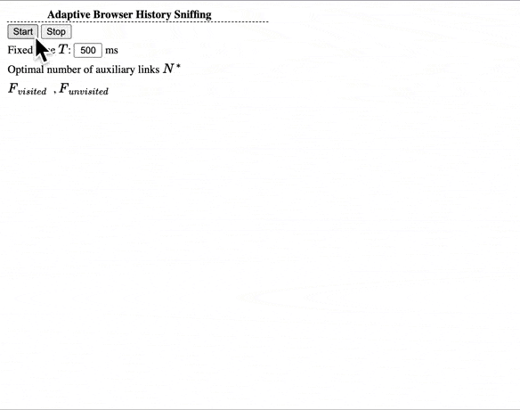

:warning: :warning: :warning: Experimental - **PLEASE BE CAREFUL**. Intended for Reasearch purposes ONLY. :warning: :warning: :warning:


This repository contains the code to demonstrate the ***Experiments*** and ***Reproduce*** the results of the **NDSS Workshops on MADWeb 2020** paper:
### An Adaptive Method for Cross-Platform Browser History Sniffing ([Read the Paper](history_sniff_NDSS_.pdf))


#### Reference Format
```
@article{huang2020,
  title={An Adaptive Method for Cross-Platform Browser History Sniffing},
  author={Huang, Anxin and Zhu, Chen and Wu, Dewen and Xie, Yi and Luo, Xiapu},
  booktitle={NDSS Workshops on MADWeb},
  year={2020}
}
```


### Reproducability of the Results
Open the [attack.html](attack.html) in any browser, then click the **Start** button to sniff the history of current browser.



